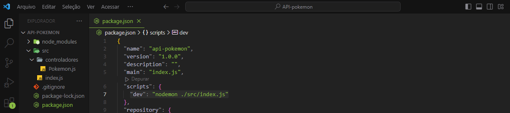
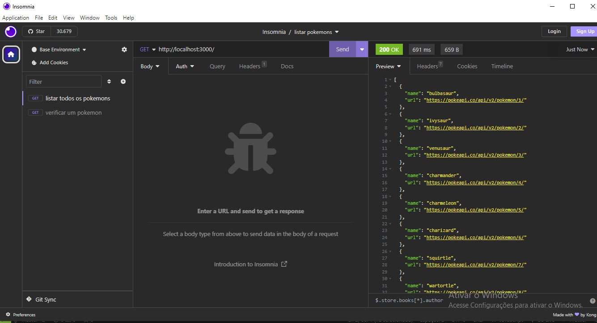
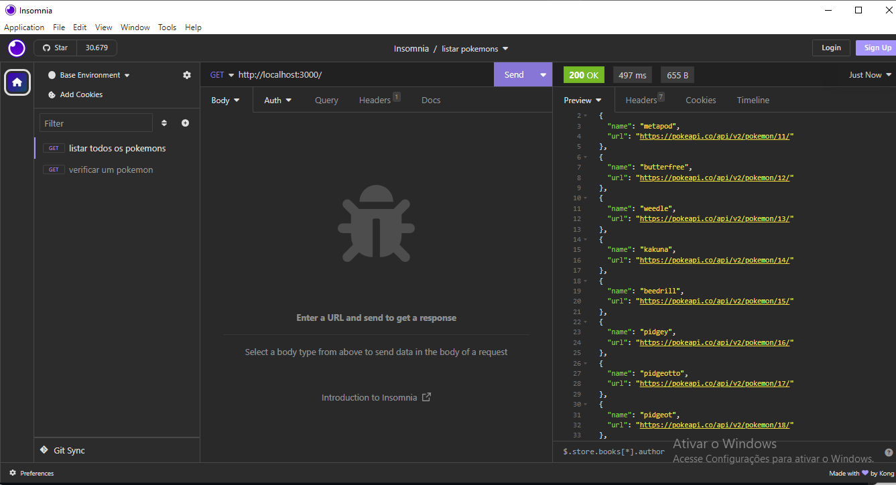
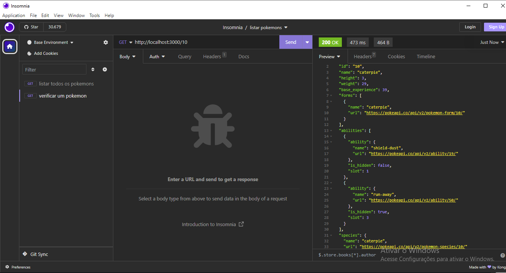

# Api-pokémon

A seguir o passo a passo para instalaçao e utilizaçao dessa API:

Primeiramente iniciamos com o comando do gerenciador de pacotes do node:

```

npm init -y

```

instalando pacotes express para criação do servidor:

```

npm express install

```

e finalmente instalamos o pacote que contem as informações dos pokémons:

```

npm install utils-playground

```

\*\*

Quem optar pode tambem instalar nodemon para reiniciar automaticamente o servidor a cada requisição:

```

npm install -D nodemon

```

Dentro da pasta package.json em scripts colocamos: "dev": "nodemon ./src/index.js"

No terminal digitamos:
```

npm run dev

```
\*\*
Com a utilizaçao do insomnia podemos testar nossas requisições:

Dentro da biblioteca util playground instanciaremos duas funções:

```

const { listarPokemons, detalharPokemon } = require("utils-playground");

```

listarPokemons() e detalharPokemon()

Sendo o argumento de listarPokemons a página que contem a lista de 10 pokémons por vez. portanto a cada requisiçao a pagina seguente é chamada:

E o argumento de detalhar pokémon é o id do pokémon selecionado: Nesta requisiçao forma fitradas

- id:
- name:
- height:
- weight:
- base_experience:
- forms:
- abilities:
- species:

No insomnia criamos duas requisiçoes get com endereço:

Listar todos os pokémons:

```

http://localhost:3000/

```
Fazendo a requisição

Fazendo uma nova requisição...

Verificar um pokémon:

```

http://localhost:3000/id

```

Exemplo:

```

http://localhost:3000/10 (pokémon 10)

```


